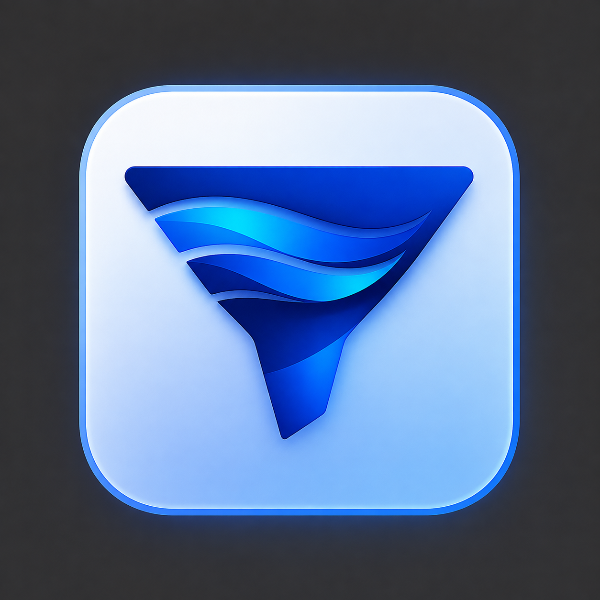
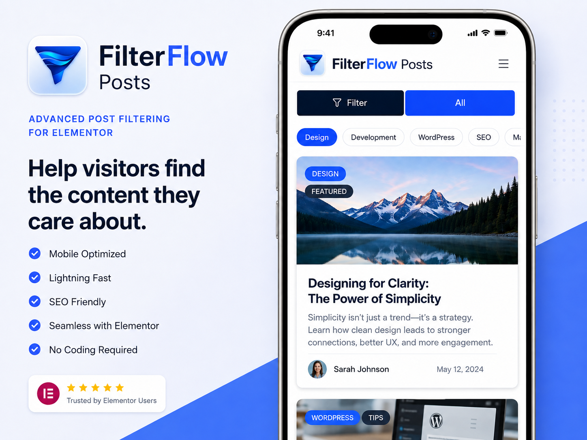

# FilterFlow Posts

<p align="center">
  
</p>

<p align="center">
  A responsive, accessible, AJAX-powered filterable posts grid widget for Elementor.
</p>

<p align="center">
  <strong>Version:</strong> 1.0.0
  &nbsp;•&nbsp;
  <strong>WordPress:</strong> 6.5+
  &nbsp;•&nbsp;
  <strong>PHP:</strong> 7.4+
  &nbsp;•&nbsp;
  <strong>Elementor:</strong> 3.20.0+
</p>

## Overview

FilterFlow Posts adds a modern filterable posts grid to Elementor without requiring Elementor Pro. It provides responsive category filters, AJAX post loading, configurable post cards, automatic filter icons, category-badge placement controls, author metadata, and extensive styling options.

## Features

### Responsive filtering

- AJAX category filtering without page reloads
- Automatic filter icons for common category names
- Individual Elementor icon overrides per category
- Blue active **All** filter with a built-in grid icon
- Desktop auto-fit category chips with a **More** overflow menu
- Tablet single-category selector or auto-fit chip layout
- Mobile **Filter + All** layout
- Swipeable mobile categories with the selected category moved first
- Automatic horizontal scroll reset after selection
- Responsive behavior based on the widget width
- Sticky-header collision detection with manual clearance controls

### Post cards

- Featured image
- Post title and smart excerpt
- Multiple category badges
- Author name and avatar
- Published or modified date
- Reading time
- Comment count
- Arrow link
- One-to-four responsive columns
- Numbered pagination, Load More, or no pagination

### Smart Elementor excerpts

Smart excerpt mode uses the following priority:

1. Manual WordPress excerpt
2. Elementor Text Editor content
3. Post content with headings removed
4. WordPress-generated excerpt

Elementor Heading widgets are ignored so the article title is not repeated inside the excerpt.

### Category badges

Category badge controls are available under **Content → Category Badges**.

Placement options include:

- Above featured image
- Below image and above title
- Overlay: top left
- Overlay: top center
- Overlay: top right
- Overlay: center left
- Overlay: center
- Overlay: center right
- Overlay: bottom left
- Overlay: bottom center
- Overlay: bottom right

Badge styling includes:

- Soft filled
- Solid
- Outline
- Underline
- Text only
- Custom or automatic palette colors
- Typography
- Padding and spacing
- Borders and border radius
- Shadows and hover effects
- Responsive alignment
- Overlay edge offset

### Filter styles

- Filled pill
- Outline
- Underline
- Overline
- Overline and underline
- Modern tabs
- Minimal text

Filter bar customization includes background, gradient, shadow, border, radius, spacing, alignment, full-width mode, sticky positioning, active states, hover states, icon size, and icon spacing.

### Accessibility

- Keyboard-accessible controls
- ARIA state updates
- Focus trapping in responsive filter dialogs
- Live result announcements
- Reduced-motion support
- Accessible button labels and navigation

## Screenshots

### Desktop


### Mobile



### Tablet


### Elementor editor


## Requirements

- WordPress 6.5 or newer
- PHP 7.4 or newer
- Elementor 3.20.0 or newer
- Elementor Pro is not required

## Installation

1. Download the plugin ZIP.
2. In WordPress, go to **Plugins → Add New Plugin → Upload Plugin**.
3. Upload the ZIP and activate **FilterFlow Posts**.
4. Edit a page with Elementor.
5. Search for **FilterFlow Posts** in the Elementor widget panel.
6. Drag the widget onto the page.
7. Configure the query, filters, post cards, responsive layouts, and styles.

After replacing an existing build, run:

**Elementor → Tools → Regenerate CSS & Data**

Also clear any WordPress, CDN, server, or browser cache.

## Development structure

```text
filterflow-posts/
├── assets/
│   ├── css/
│   │   └── filterflow-posts.css
│   ├── images/
│   │   ├── filterflow-logo.png
│   │   ├── icon-128x128.png
│   │   └── icon-256x256.png
│   ├── js/
│   │   └── filterflow-posts.js
│   └── screenshots/
├── includes/
│   ├── class-filterflow-ajax.php
│   ├── class-filterflow-plugin.php
│   ├── class-filterflow-renderer.php
│   └── class-filterflow-widget.php
├── languages/
├── filterflow-posts.php
├── readme.txt
└── uninstall.php
```

## Security and code quality

- AJAX input is unslashed, sanitized, validated, and bounded.
- Query options use allow-lists.
- Public output uses context-appropriate escaping.
- Icon markup is restricted through an explicit `wp_kses()` allow-list.
- Direct file access is blocked.
- No custom database tables are created.
- No tracking, advertising, or analytics are included.
- CSS and JavaScript are loaded through WordPress and Elementor dependency APIs.

## Privacy

FilterFlow Posts does not collect, sell, or share personal data. AJAX requests remain on the site where the plugin is installed and contain only the selected category, page number, and limited widget query settings required to render public posts.

When author avatars are enabled, WordPress core `get_avatar()` is used. Depending on the site configuration, avatar URLs may be served by an external provider such as Gravatar.

## Frequently asked questions

### Does it require Elementor Pro?

No. FilterFlow Posts works with the free Elementor plugin.

### Can category badges appear over the featured image?

Yes. Eleven placement modes are available, including top, center, and bottom overlay positions.

### Can filter chips use icons?

Yes. Automatic icons are enabled for common category names, and every category can be assigned a custom Elementor icon.

### Why is a heading not included in the excerpt?

Smart excerpt mode intentionally ignores Elementor Heading widgets to prevent the post title from appearing twice.

### Can the filters work inside narrow Elementor containers?

Yes. Responsive switching uses the widget width rather than only the browser viewport width.

## Changelog

### 1.0.0

- Initial public release
- Added AJAX category filtering and pagination
- Added desktop, tablet, and mobile responsive filter layouts
- Added automatic and custom filter icons
- Added smart Elementor excerpts
- Added multiple category badges and image-overlay positions
- Added author metadata and avatar controls
- Added accessible responsive filter dialogs
- Added extensive Elementor design controls
- Added output escaping and AJAX sanitization compliance fixes
- Added transparent PNG logo assets

## Support

- Plugin page: https://farhan.ch/filterflow
- Author: [Farhan Ahmed](https://farhan.ch/)

## License

FilterFlow Posts is licensed under the GNU General Public License v2.0 or later.

See [LICENSE](LICENSE) and [COPYING](COPYING) for details.
